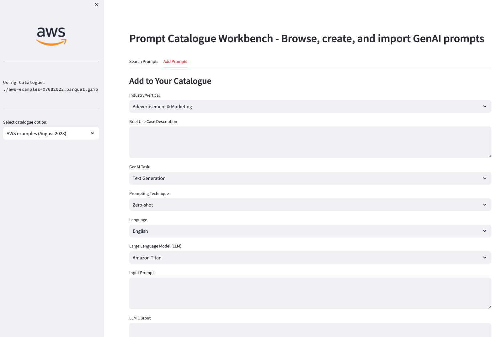

# Amazon Bedrock Prompting Examples & Tools

This repo has a set of prompting examples and prompt engineering tools for working with Amazon Bedrock.

You can explore:

1. Notebooks with prompt examples per industry:
    * [Basic examples for Media & Entertainment](./notebooks/bedrock-prompt-media-entertainment_rodzanto.ipynb)
    * [Basic examples for Insurance](./notebooks/bedrock-prompt-insurance_rodzanto.ipynb)
    * [Basic examples for Travel](./notebooks/bedrock-prompt-travel_hospitality_rodzanto.ipynb)
    * [ReAct example for travel](./notebooks/ReAct-Prompting-langchain-agents_rodzanto.ipynb)

2. Notebooks with examples for prompt misuse mitigation and evaluation:
    * [Prompt Misuse detection/mitigation](./notebooks/bedrock-prompt-misuse_rodzanto.ipynb)
    * [Prompt Self-Evaluation](./notebooks/bedrock-prompt-evaluation_rodzanto.ipynb)

3. Useful tools for working with Generative AI prompts:
    * [Auto-Prompting assistant](./auto-prompting/)

    

    * [Prompt Examples Browser & Creator](./prompts-catalogue/)

    

