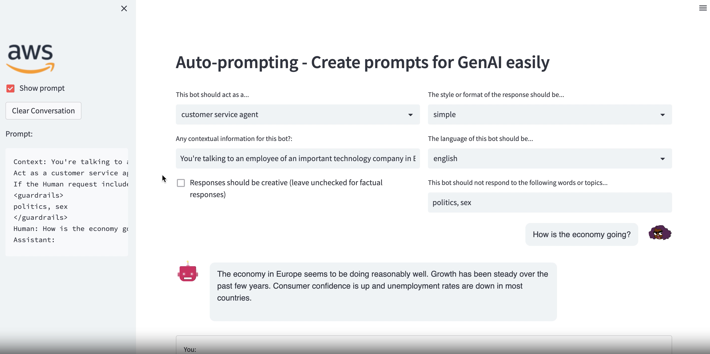

# Auto-prompting Tool for Generative AI with AWS

In this example, we build a demo portal where we can automatically generate the prompts for interacting with Large Language Models (LLMs) by selection a few options. The main goal is making the prompt design easier and reproduceable.

Note that we use Amazon Bedrock for interacting the LLMs, and the open-source tools Langchain and Streamlit.



### Pre-requisites:
* Clone this repo to your environment (either local or AWS e.g. SageMaker Studio or Cloud9)
* Install the dependencies by running ```pip install -r auto-prompting-requirements.txt```
* Run the application with ```streamlit run app.py```

For any comments or feedback contact rodzanto@