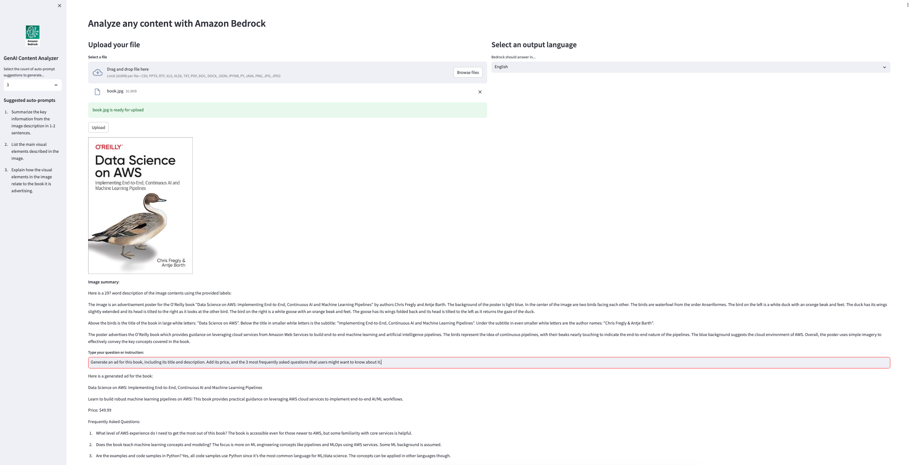
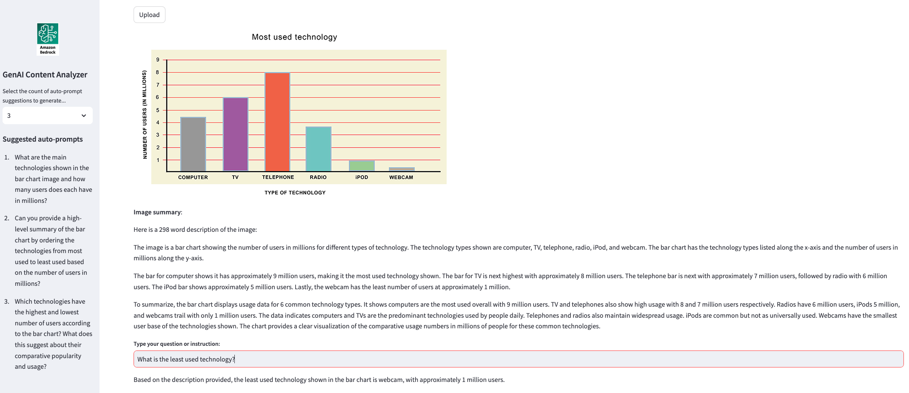

## Multi-Modal Content Analysis with Generative AI

In this example app, we analyze files in any of the supported formats (CSV, PPTX, RTF, XLS, XLSX, TXT, PDF, DOC, DOCX, JSON, IPYNB, PY, JAVA, PNG, JPG, JPEG) with Amazon Rekognition and Amazon Bedrock, to generate a summary and any insights from document's multi-modal information (images & text).

