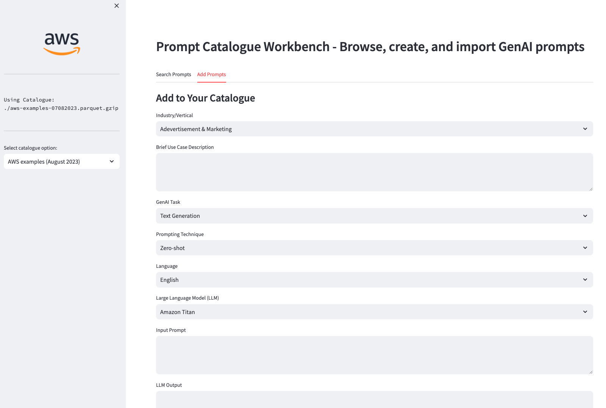

# Generative AI Prompt Examples Workbench with AWS

This tool allows creating, importing, and browsing prompt examples per use case, industry, language, task, model, and prompting technique, for using in AWS (Amazon Bedrock or Amazon SageMaker).

We provide a default catalogue of example prompts that you can enrich or adapt for your needs.



### Pre-requisites:
* Clone this repo to your environment (either local or AWS e.g. SageMaker Studio or Cloud9)
* Install the dependencies by running ```pip install -r prompts-catalogue-requirements.txt```
* Run the application with ```streamlit run prompt-browser.py```

For any comments or feedback contact rodzanto@